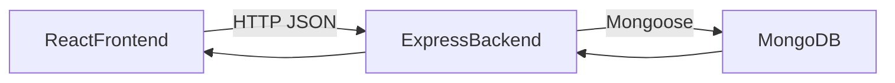

# MERN Task Management System

This project is a Task Management System inspired by Microsoft To Do, with additional workflow and prioritization features for academic submission.

## Tech Stack

- Frontend: React (Vite)
- Backend: Node.js + Express
- Database: MongoDB (Mongoose)

## Features

- Create, read, update, and delete tasks
- Status workflow:
  - To Do
  - In Progress
  - Done
- Priority levels:
  - Low
  - Medium
  - High
- Deadline support
- Optional task assignment by username (`assignedTo`)
- Task filtering by status and priority

## Project Structure

```text
task-manager/
|-- client/
|-- server/
|-- docs/
`-- README.md
```

## Setup Instructions (Local)

### 1) Backend setup

```bash
cd server
npm install
```

Create `.env` from `.env.example`:

```env
PORT=5000
MONGO_URI=your_mongodb_connection_string
```

Run backend:

```bash
npm run dev
```

### 2) Frontend setup

In a new terminal:

```bash
cd client
npm install
npm run dev
```

Frontend URL: `http://localhost:5173`

## API Routes

Base URL: `http://localhost:5000/api/tasks`

- `POST /` - Create task
- `GET /` - Get all tasks (supports query: `status`, `priority`)
- `GET /:id` - Get task by ID
- `PUT /:id` - Update task
- `DELETE /:id` - Delete task

## Architecture Diagram



## Manual Test Checklist

See `docs/test-checklist.md`.

## Notes

- Deployment is intentionally skipped for now.
- MongoDB URI will be added by user at the final setup step.
